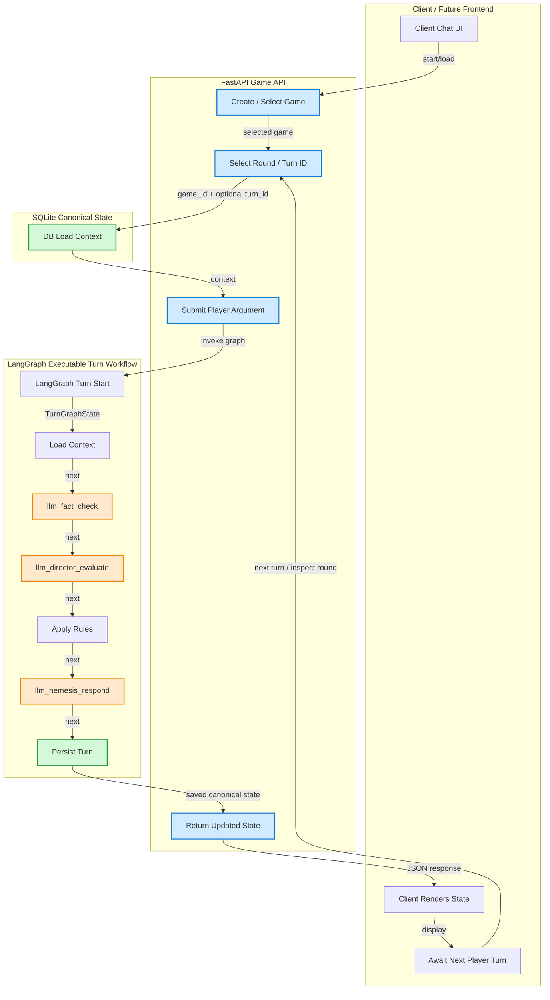

# Arch Nemesis Reload


> Convince an Arch Linux user to install Windows.

Arch Nemesis is an AI-powered argument game where your goal is to persuade an increasingly stubborn Arch Linux fanboy to abandon Arch and install Windows.

Make your case however you want. Argue about software compatibility, gaming, hardware support, productivity, ease of use, Linux itself, or anything else you think might work. Arch Nemesis will argue back, challenge your claims, and decide whether you're actually changing its mind.

## Where It Came From

The original **Arch Nemesis** was built during an AI bootcamp at UBS as my introduction to LangGraph, LangChain, Azure AI, and agentic workflows.

The idea came from a problem I was having at the time: I was doing my development work inside a Windows VM running on my Arch Linux laptop. It ran terribly. After about a month of fighting with it, I finally gave up and installed Windows on a separate partition.

So naturally, I made a game about convincing an Arch Linux user to do the same thing.

The original project used multiple agents to process the player's arguments, manage the state of the game, and maintain Arch Nemesis's personality throughout the conversation. It was small, weird, and mostly built as a way to experiment with AI application development.

It also ended up being genuinely useful. Much of what I learned while building it carried directly into the larger LangGraph systems I worked on afterward.

## Why Reload?

The original Arch Nemesis was built inside a corporate environment and was never really a public project I could continue developing as my own.

**Arch Nemesis Reload** is a recreation of that game from scratch, honestly meant to slap onto my profiles and resume.

The goal isn't to pretend the original project was something it wasn't, or to turn a little bootcamp game into an enormous production platform. I just liked the idea, wanted a version I could actually publish and maintain, and thought it would be fun to revisit it with everything I've learned since.

Reload keeps the same basic premise and agent-driven game structure while rebuilding the implementation as a standalone application with a React frontend, Python backend, LangGraph workflow, and SQLite persistence.

It's still fundamentally a game about arguing with an Arch user until they install Windows.




## Backend stack

- FastAPI
- LangGraph
- SQLite
- Micromamba
- Real LLM calls by default
- Explicit dry-run mode for tests, CI, offline checks, and reproducible evals

## Run the backend

```bash
cp .env.example .env
cd backend
micromamba env create -f environment.yml
micromamba activate arch-nemesis-reload-backend
python -m pip install -e .
uvicorn arch_nemesis.main:app --reload
```

After the editable install has been run once, normal development startup is:

```bash
cd backend
micromamba activate arch-nemesis-reload-backend
uvicorn arch_nemesis.main:app --reload
```

If shell activation is not initialized for micromamba, use:

```bash
cd backend
micromamba run -n arch-nemesis-reload-backend uvicorn arch_nemesis.main:app --reload
```

The backend runs at `http://localhost:8000`.

## Key URLs

- `GET /api/health`: app/database health
- `GET /api/health/llm`: LLM configuration health
- `POST /api/games`: create a game
- `GET /api/games`: list games
- `GET /api/games/{game_id}`: load a game with messages
- `POST /api/games/{game_id}/turns`: submit a player argument
- `POST /api/llm/respond`: direct Nemesis development endpoint
- `POST /api/llm/fact-check`: direct fact checker development endpoint
- `POST /api/llm/director-evaluate`: direct director development endpoint
- `GET /graph`: browser-viewable LangGraph inspection page
- `GET /api/graph/spec`: JSON graph spec
- `GET /api/graph/mermaid`: Mermaid graph source

## Scripts

```bash
./scripts/dev-backend.sh
./scripts/test-backend.sh
./scripts/run-evals.sh
```

## LLM mode

Real LLM behavior is the primary product path. Set `OPENAI_API_KEY` in `.env` for live OpenAI calls.

Set `DRY_RUN_MODE=true` only for tests, CI, offline development, or deterministic eval harness runs.


## Famous Words from a former coworker

> "don't let me catch you writing a single line of code" - LC, Jan 2026
