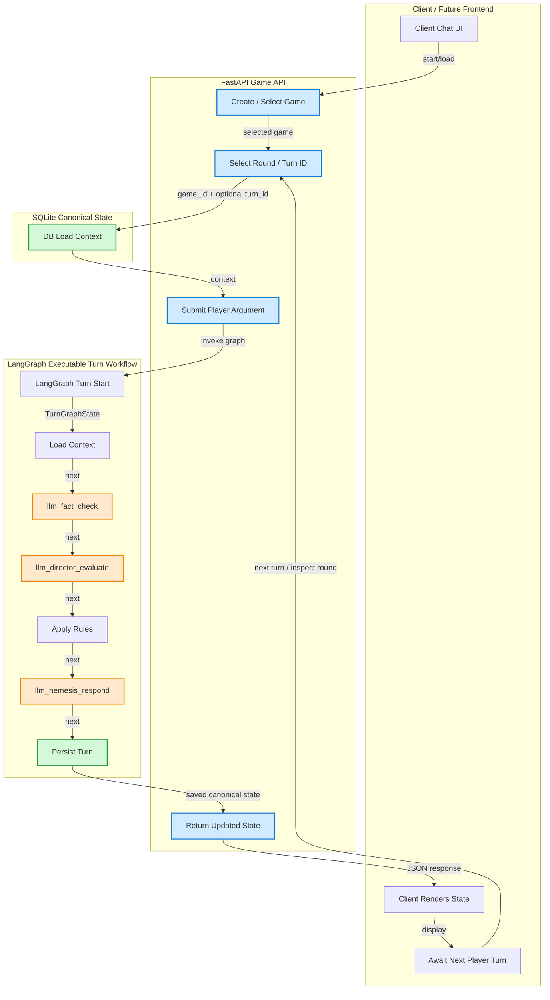

# Arch Nemesis: Reload

Arch Nemesis: Reload is a stateful, LLM-first persuasion game where the player tries to convince an arrogant Arch Linux zealot AI to install Windows.

Current milestone: backend first. React/frontend work is deferred until the backend game loop, LLM path, LangGraph orchestration, persistence, graph inspection page, tests, and eval harness are working.




## Backend stack

- FastAPI
- LangGraph
- SQLite
- Micromamba
- Real LLM calls by default
- Explicit dry-run mode for tests, CI, offline checks, and reproducible evals

## Run the backend

```bash
cp .env.example .env
cd backend
micromamba env create -f environment.yml
micromamba activate arch-nemesis-reload-backend
python -m pip install -e .
uvicorn arch_nemesis.main:app --reload
```

After the editable install has been run once, normal development startup is:

```bash
cd backend
micromamba activate arch-nemesis-reload-backend
uvicorn arch_nemesis.main:app --reload
```

If shell activation is not initialized for micromamba, use:

```bash
cd backend
micromamba run -n arch-nemesis-reload-backend uvicorn arch_nemesis.main:app --reload
```

The backend runs at `http://localhost:8000`.

## Key URLs

- `GET /api/health`: app/database health
- `GET /api/health/llm`: LLM configuration health
- `POST /api/games`: create a game
- `GET /api/games`: list games
- `GET /api/games/{game_id}`: load a game with messages
- `POST /api/games/{game_id}/turns`: submit a player argument
- `POST /api/llm/respond`: direct Nemesis development endpoint
- `POST /api/llm/fact-check`: direct fact checker development endpoint
- `POST /api/llm/director-evaluate`: direct director development endpoint
- `GET /graph`: browser-viewable LangGraph inspection page
- `GET /api/graph/spec`: JSON graph spec
- `GET /api/graph/mermaid`: Mermaid graph source

## Scripts

```bash
./scripts/dev-backend.sh
./scripts/test-backend.sh
./scripts/run-evals.sh
```

## LLM mode

Real LLM behavior is the primary product path. Set `OPENAI_API_KEY` in `.env` for live OpenAI calls.

Set `DRY_RUN_MODE=true` only for tests, CI, offline development, or deterministic eval harness runs.
